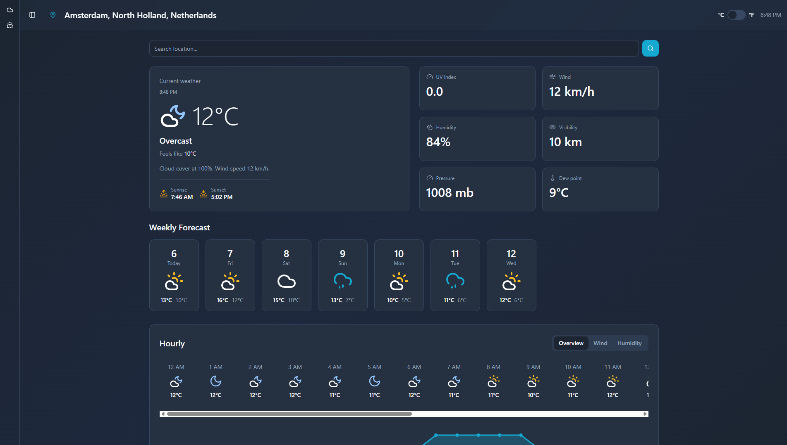

# 🌤️ Look at This Weather

A modern, feature-rich weather application built with React, TypeScript, and Vite. Get real-time weather data, hourly and weekly forecasts, and specialized maritime weather information all in one beautiful interface.



## ✨ Features

### 🌍 General Weather
- **Real-time Weather Data**: Current temperature, humidity, wind speed, pressure, and more
- **Location Services**: 
  - Automatic geolocation detection
  - Manual location search with autocomplete
  - Support for worldwide locations
- **Comprehensive Forecasts**:
  - 24-hour hourly forecast
  - 7-day weekly forecast
  - Detailed weather metrics (UV index, dew point, visibility, etc.)
- **Temperature Units**: Toggle between Celsius and Fahrenheit
- **Weather Visualizations**: Clear weather icons and intuitive UI components

### ⚓ Maritime Weather
- **Specialized Maritime Interface**: Tailored for sailors and maritime activities
- **Wind Conditions**: Detailed wind speed, direction, and gusts
- **Weather Alerts**: Real-time browser notifications for severe weather
- **Wave Information**: Maritime-specific weather parameters
- **Safety Features**: Warning system for dangerous conditions

### 🎨 User Experience
- **Responsive Design**: Works seamlessly on desktop, tablet, and mobile
- **Dark/Light Mode**: Beautiful theming with Tailwind CSS
- **Collapsible Sidebar**: Clean navigation between weather views
- **Modern UI**: Built with Radix UI primitives and Tailwind CSS
- **Fast Performance**: Powered by Vite and React Query for optimal loading

## 🚀 Getting Started

### Prerequisites

- **Node.js** (v18 or higher) - [Install with nvm](https://github.com/nvm-sh/nvm#installing-and-updating)
- **npm** or **bun** package manager

### Installation

1. **Clone the repository**
   ```bash
   git clone https://github.com/TropoMetrics/look-at-this-weather.git
   cd look-at-this-weather
   ```

2. **Install dependencies**
   ```bash
   npm install
   # or
   bun install
   ```

3. **Start the development server**
   ```bash
   npm run dev
   # or
   bun run dev
   ```

4. **Open your browser**
   - Navigate to `http://localhost:8080`

### Building for Production

```bash
npm run build
# or
bun run build
```

The built files will be in the `dist` directory.

## 🐳 Docker Deployment

### Using Docker Hub or GitHub Container Registry

The application is automatically built and published to Docker registries via GitHub Actions:

- **Docker Hub** (internal only): `[username]/look-at-this-weather`
- **GitHub Container Registry**: `ghcr.io/tropometrics/look-at-this-weather`

Pull and run the latest image:

```bash
docker pull ghcr.io/tropometrics/look-at-this-weather:main
docker run -p 80:80 ghcr.io/tropometrics/look-at-this-weather:main
```

### Building Locally

```bash
docker build -t look-at-this-weather .
docker run -p 80:80 look-at-this-weather
```

The application will be available at `http://localhost`

## 🛠️ Technology Stack

### Frontend Framework
- **React 18** - Modern React with hooks and concurrent features
- **TypeScript** - Type-safe development
- **Vite** - Lightning-fast build tool and dev server

### UI & Styling
- **Tailwind CSS** - Utility-first CSS framework
- **Radix UI** - Unstyled, accessible component primitives
- **Lucide React** - Beautiful icon library

### State & Data Management
- **TanStack Query (React Query)** - Powerful async state management
- **React Router DOM** - Client-side routing
- **React Hook Form** - Performant form handling

### Weather Data
- **TropoMetrics API** - Custom weather API endpoint
- **Open-Meteo Compatible** - Uses Open-Meteo data format
- **Nominatim** - Reverse geocoding for location names

### Development Tools
- **ESLint** - Code linting and quality
- **PostCSS** - CSS processing
- **SWC** - Fast TypeScript/JavaScript compiler

## 📂 Project Structure

```
look-at-this-weather/
├── src/
│   ├── components/          # React components
│   │   ├── ui/             # UI components
│   │   ├── AppSidebar.tsx  # Navigation sidebar
│   │   ├── CurrentWeather.tsx
│   │   ├── HourlyForecast.tsx
│   │   ├── WeeklyForecast.tsx
│   │   ├── WeatherDetails.tsx
│   │   ├── LocationSearch.tsx
│   │   └── RainIcons.tsx
│   ├── contexts/           # React contexts
│   │   └── TemperatureUnitContext.tsx
│   ├── hooks/              # Custom React hooks
│   │   ├── useWeather.ts
│   │   └── use-toast.ts
│   ├── lib/                # Utilities and API
│   │   ├── weatherApi.ts   # Weather data fetching
│   │   └── utils.ts        # Helper functions
│   ├── pages/              # Page components
│   │   ├── Index.tsx       # Main weather page
│   │   ├── MaritimeWeather.tsx
│   │   └── NotFound.tsx
│   ├── App.tsx             # Root component
│   └── main.tsx            # Entry point
├── public/                 # Static assets
├── .github/workflows/      # CI/CD pipelines
├── Dockerfile             # Docker configuration
├── vite.config.ts         # Vite configuration
├── tailwind.config.ts     # Tailwind configuration
└── package.json           # Dependencies
```

## 🌐 API Integration

The application uses the TropoMetrics Weather API, which is Open-Meteo compatible, for fetching weather data:

```
https://api.tropometrics.tech/v1/forecast
```

**Supported Parameters:**
- Current weather conditions
- Hourly forecasts (7 days)
- Daily forecasts (7 days)
- Multiple weather variables (temperature, wind, precipitation, etc.)

## 🔧 Configuration

### Environment Variables

Create a `.env` file if you need custom configuration (optional):

```env
VITE_API_BASE_URL=https://api.tropometrics.tech
```

### Tailwind Configuration

The project uses a custom Tailwind configuration with:
- Custom color schemes
- Dark mode support
- Custom animations
- Typography plugin

## 📱 Browser Support

- Chrome/Edge (latest)
- Firefox (latest)
- Safari (latest)
- Mobile browsers (iOS Safari, Chrome Mobile)

**Features requiring permissions:**
- Geolocation API - for automatic location detection
- Notifications API - for maritime weather alerts

## 🤝 Contributing

Contributions are welcome! Here's how you can help:

1. **Fork the repository**
2. **Create a feature branch**
   ```bash
   git checkout -b feature/amazing-feature
   ```
3. **Commit your changes**
   ```bash
   git commit -m 'Add some amazing feature'
   ```
4. **Push to the branch**
   ```bash
   git push origin feature/amazing-feature
   ```
5. **Open a Pull Request**

### Development Guidelines

- Follow the existing code style
- Use TypeScript for type safety
- Write meaningful commit messages
- Test your changes across different screen sizes
- Ensure ESLint passes: `npm run lint`

## 📄 License

This project is for educational purposes.

---

**Authors:** Max Blaauw, Arne Jansonius, Kai Diemel & Ole Spiegelenberg  
**Organization:** HHS (The Hague University of Applied Sciences)  
**Domain:** hhs.nl
